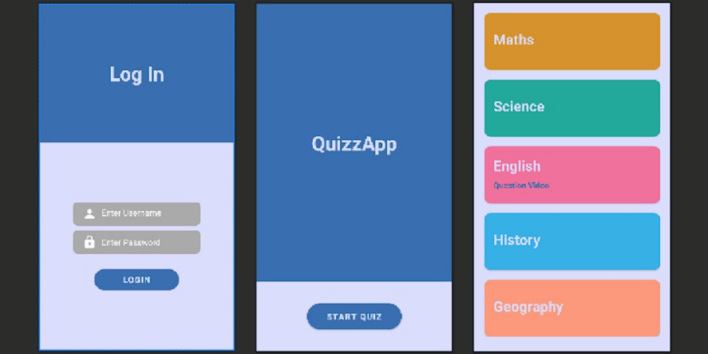

# Quiz Android Application using Java and XML Programming Languages (Android Studio)
This is a final project of the Wireless and Mobile Programming course that we worked on in a group team called 'JAM Group'. In this project, we created a Quiz Application with user sign-in and sign-up and there are five categories for the Quiz such as Math, Science, English, History, and Geography along with the explanation video that can be downloaded.

For the question itself, it has a multiple-choice type with 4 options, +10 points and +20 secs time if correct, and -5 points and -30 secs time if false for each question and there are 5 questions and 60 seconds time to answer all of the questions for each category. We created this application using Android Studio with Java and XML programming languages and it also connected to the database.

